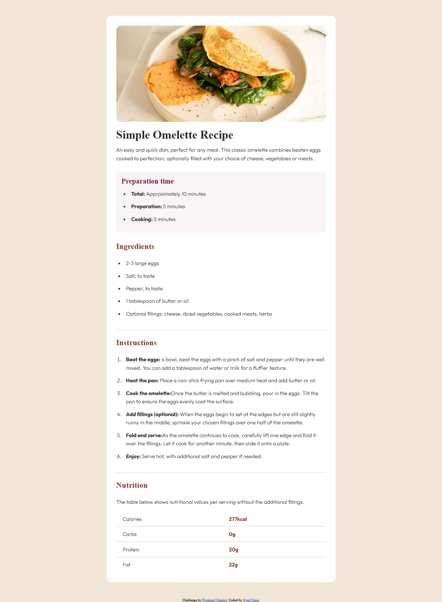

# Frontend Mentor - Recipe page solution

This is a solution to the [Recipe page challenge on Frontend Mentor](https://www.frontendmentor.io/challenges/recipe-page-KiTsR8QQKm). Frontend Mentor challenges help you improve your coding skills by building realistic projects. 

## Table of contents

- [Overview](#overview)
  - [The challenge](#the-challenge)
  - [Screenshot](#screenshot)
  - [Links](#links)
- [My process](#my-process)
  - [Built with](#built-with)
  - [What I learned](#what-i-learned)
  - [Continued development](#continued-development)
- [Author](#author)

### Links

- Solution URL: [Repository Home](https://github.com/SyedSami90/Recipe-template)

- Live Site URL: [Live Site](https://SyedSami90.github.io/Recipe-template)

## My process

### Built with

- Semantic HTML5 markup
- CSS custom properties
- Flexbox

### What I learned

- Practical usage of Flexbox for layout
- How to avoid redundancy in code
- Proper positioning of lists within the layout
- Improved understanding of responsiveness

### Continued development

In the future, I plan to improve the responsiveness of this project as I learn more about responsive design. My goal is to make sure it looks great and works well on all devices.

## Author

- Github- [SyedSami](https://github.com/SyedSami)
- frontendmentor- [@SyedSami](https://github.com/SyedSami)

